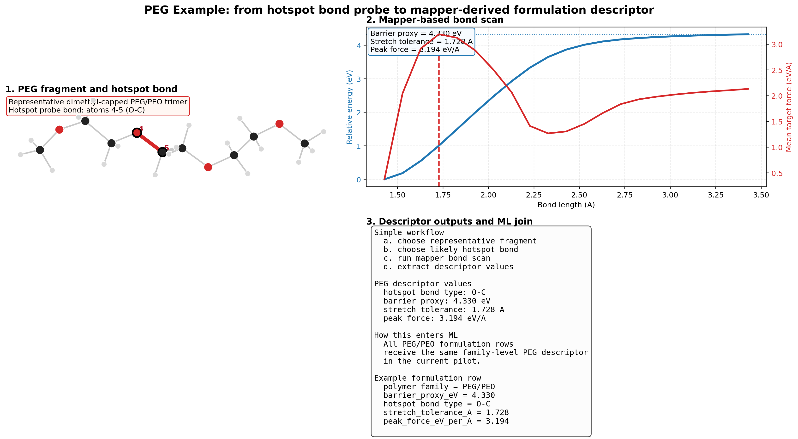

# PEG Descriptor Example

This page shows one complete reviewer-friendly example of how the mapper generates a polymer descriptor.

## Very Simple Workflow

1. Choose a representative polymer fragment.
2. Identify one likely hotspot bond.
3. Run a mapper-based bond scan or stress probe.
4. Extract a small set of descriptor values.
5. Join those descriptor values back to formulation rows.

## PEG Example

### 1. Representative polymer fragment

- polymer family: `PEG/PEO`
- representative fragment: `PEG/PEO trimer-like fragment`
- fragment ID: `peg_trimer_dimethyl_capped`
- repeat units: `3`
- end capping: `dimethyl-capped oligomer ends`

### 2. Hotspot bond selection

- probe bond atoms: `4-5`
- hotspot bond type: `O-C`
- rationale: central ether backbone `O-C` bond selected as a representative polyether scission motif

### 3. Mapper-based bond scan

- scan type: rigid bond-stretch scan
- start bond length: `1.428 A`
- end bond length: `3.428 A`
- step size: `0.1 A`
- number of frames: `21`
- inference checkpoint: `uma-s-1p1_reactive_scale_100k`

### 4. Extracted descriptor values

- hotspot bond type: `O-C`
- barrier proxy: `4.330 eV`
- stretch tolerance: `1.728 A`
- peak force: `3.194 eV/A`

## How This Enters The ML Table

In the current pilot, the descriptors are attached at the polymer-family level.

That means:

- every formulation row with `PEG/PEO` as the polymer family receives the PEG descriptor values
- these values are added as extra ML features alongside normal formulation and process variables

Example feature values for a PEG row:

- `barrier_proxy_eV = 4.330`
- `hotspot_bond_type = O-C`
- `stretch_tolerance_A = 1.728`
- `peak_force_eV_per_A = 3.194`

## Current Interpretation

The purpose of this example is not to claim that a single PEG bond scan predicts full formulation success.

The purpose is to show the mechanism clearly:

- start from a physically meaningful polymer fragment
- probe one chemically relevant bond
- extract a compact and interpretable descriptor set
- feed those chemistry-aware values back into downstream formulation ML

## Related Files

- [`../results/peg_descriptor_example.csv`](../results/peg_descriptor_example.csv)
- [`../results/peg_bond_scan_metrics.csv`](../results/peg_bond_scan_metrics.csv)
